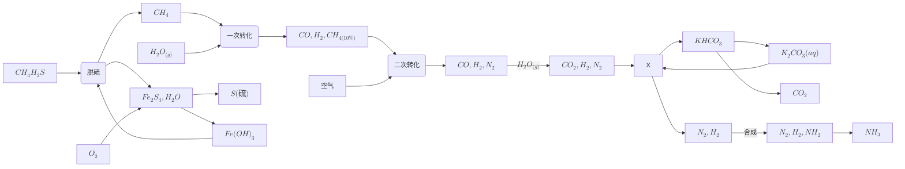

# 流程图

```mermaid
graph LR;
A["$$CH_4 H_2S$$"]-->B(脱硫)
B --> C["$$CH_4$$"]
B --> D["$$Fe_2S_3, H_2O$$"]
C --> E(一次转化)
F["$$H_2O_{(g)}$$"] --> E
E --> G["$$CO, H_2, CH_{4(10\%)}$$"]
G --> H(二次转化)
I[空气] --> H
H --> J["$$CO, H_2, N_2$$"]
J --> |"$$H_2O_{(g)}$$"|K["$$CO_2, H_2, N_2$$"]
K --> X
X --> L["$$N_2, H_2$$"]
X --> M["$$KHCO_3$$"]
N["$$K_2CO_3{(aq)}$$"] --> X
M --> N
M --> O["$$CO_2$$"]
L --> |合成|P["$$N_2, H_2, NH_2$$"]
P --> Q["$$NH_3$$"]
D --> R["$$S(硫)$$"]
S["$$O_2$$"] --> D
D --> T["$$Fe(OH)_3$$"]
T --> B
```
